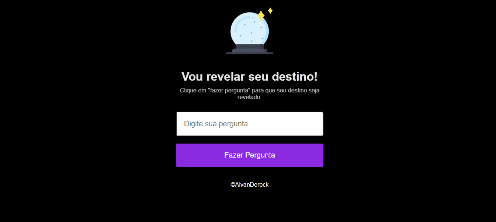

# 🤟🏽 AivanFuture

AivanFuture: uma jornada marcante. Falar sobre este projeto é um desafio, pois AivanFuture representa um marco significativo em minha trajetória. Ele não só marcou meus primeiros passos na web com as principais tecnologias (HTML, CSS e JS), como também permanece como o projeto mais impactante até hoje, apesar de já ter compartilhado 26 projetos em meu repositório no GitHub.

No entanto, vamos além do passado. A história do AivanFuture começa com um evento marcante: a primeira "Maratona Explorer 1.0", gentilmente promovida pela Rocketseat. Foi nesse contexto inspirador que AivanFuture tomou forma.

O propósito subjacente à criação do AivanFuture é bem simples: espalhar diversão e trazer um toque de ilusão ao cotidiano. A funcionalidade básica envolvia permitir que os usuários façam perguntas, com a promessa de respostas variadas, como "sim", "talvez", "não", "conte com isso" e muito mais. Esse aspecto lúdico proporciona um espaço para brincadeira e descontração.

AivanFuture é mais do que um projeto; é um testemunho da minha evolução. Representa a habilidade de transformar conceitos técnicos em algo envolvente e interativo. Um pequeno fragmento da minha jornada que sempre traz um sorriso quando olho para trás.

## Respostas

Algumas das respostas icônicas que ele proporcionava incluíam:

"Certeza!"  
"Não tenho tanta certeza."  
"É decididamente assim."  
"Não conte com isso."  
"Sem dúvidas!"  
"Pergunte novamente mais tarde."  
"Sim, definitivamente!"  
"Minha resposta é não."  
"Você pode contar com isso."  
"Melhor não te dizer agora."  
"A meu ver, sim."  
"Minhas fontes dizem não."  
"Provavelmente."  
"Não é possível prever agora."  
"Perspectiva boa."  
"As perspectivas não são tão boas."  
"Sim."  
"Concentre-se e pergunte novamente."  
"Sinais apontam que sim."

## 📺 Demonstração

## 💻 Tech Stack:

## 🚀 Referência/Material

- [Site](https://app.rocketseat.com.br/plus/lesson/dominando-os-fundamentos-da-programacao)
- [Youtube](https://www.youtube.com/@rocketseat)
- [Notion](https://efficient-sloth-d85.notion.site/Maratona-Explorer-1-0-a90d9b149e2e40c8863d0732007fa05d)
- [FrontEditor](fronteditor.dev/gists/3abcba9e90e2763ab4d2689c9897ebbd/view)

## 🔗 Licença

- [MIT License](https://choosealicense.com/licenses/mit/)

## ⭐ Suporte/Feedback

- Para suporte ou feedback, entrar em contato via email (ivan.rocha.0987@gmail.com) ou entre em contato via whatsapp (41) 98468-5317.

## 🚩 Autores

- [@IvanRocha](https://www.github.com/ivanrocha10)
- [@Rocketseat](https://github.com/Rocketseat)

## 🔥 Projeto

  Acesse o "AivanFuture" pelo QR:

  

Caso o QR não funcione, acesse <a href="https://ivanrocha10.github.io/AivanFuture/">aqui</a>

