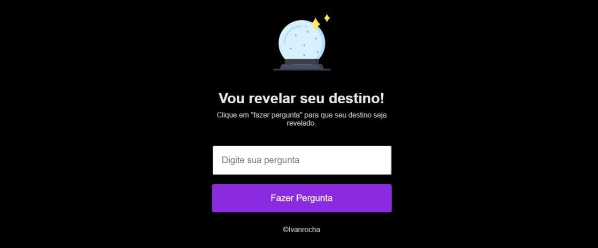

# Destino

O projeto Destino, teve seu início a partir do evento fornecido pela rocketseat, a primeira "Maratona Explorer 1.0"

Destino foi criado com o objetivo de "diversão", para alegrar ou iludir seu dia. Tendo a opção de fazer uma pergunta, o cliente tem a possibilidade de receber várias respostas, exemplo: sim, talvez, não, conte com isso, etc...

## Respostas

<li>"Certeza!",
<li>"Não tenho tanta certeza.",
<li>"É decididamente assim.",
<li>"Não conte com isso.",
<li>"Sem dúvidas!",
<li>"Pergunte novamente mais tarde.",
<li>"Sim, definitivamente!",
<li>"Minha resposta é não.",
<li>"Você pode contar com isso.",
<li>"Melhor não te dizer agora.",
<li>"A meu ver, sim.",
<li>"Minhas fontes dizem não.",
<li>"Provavelmente.",
<li>"Não é possível prever agora.",
<li>"Perspectiva boa.",
<li>"As perspectivas não são tão boas.",
<li>"Sim.",
<li>"Concentre-se e pergunte novamente.",
<li>"Sinais apontam que sim.",

## Demonstração

## 💻 Tech Stack:
  
  
  
 

## Material

https://efficient-sloth-d85.notion.site/Maratona-Explorer-1-0-a90d9b149e2e40c8863d0732007fa05d

## Licença

[MIT License](https://choosealicense.com/licenses/mit/)

## Suporte

Para suporte, mande um email para ivan.rocha.0987@gmail.com ou entre em contato via whatsapp (41) 98468-5317.

## Feedback

Se você tiver algum feedback, por favor enviar para ivan.rocha.0987@gmail.com

## Autores

- [@IvanRocha](https://www.github.com/ivanrocha10)
- [@Rocketseat](https://github.com/Rocketseat)

## Projeto

  Acesse o "Destino" pelo QR:

  

Caso o QR não funcione, acesse <a href="https://ivanrocha10.github.io/Destino/">aqui</a>

